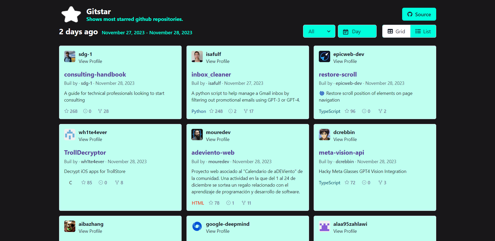

# Gitstar
> Gitstar is a React application designed to show the most starred projects uploaded to GitHub in the desired space of time.


[](https://github.com/thekaranchauhan/Gitstar)

## Table of Contents 
- [Usage](#Usage)
- [Installation](#Installation)
- [Contribute](#Contribute)
- [Support](#Support)
- [License](#License)

---

## Usage
You can access to it on https://github.com/thekaranchauhan/Gitstar

---

## Installation
To install run the following commands in the root folder. (You can use npm if you please)
```shell
yarn install
```
To serve a development build use the following command. (You can use npm if you please)
```shell
yarn start
```
To build the app for production, use the following command.
```shell
yarn build
```
It will create a `build` folder with the static files.

---

## Contribute

You can contribute to the development or improvement of this app and it will be much appreciated if you do !

To do so:

### Step 1

- Fork this repo!

OR

- Clone this repo to your local machine using `https://github.com/thekaranchauhan/Gitstar.git`

### Step 2

- **HACK AWAY!** 🔨🔨🔨

### Step 3

- Create a new pull request using <a href="https://github.com/thekaranchauhan/Gitstar/compare/" target="_blank">`https://github.com/thekaranchauhan/Gitstar/compare/`</a>.

---

## Support

Reach out to me at one of the following places!

<!-- - Website at <a href="https;//thekaranchauhan.com" target="_blank">`thekaranchauhan.com`</a> -->
- Twitter at <a href="https://x.com/hellokaranhere" target="_blank">`@hellokaranhere`</a>


---

## License


- **[MIT license](http://opensource.org/licenses/mit)**
- Copyright 2020 © <a href="https;//thekaranchauhan.com" target="_blank">Karan Chauhan</a>.
